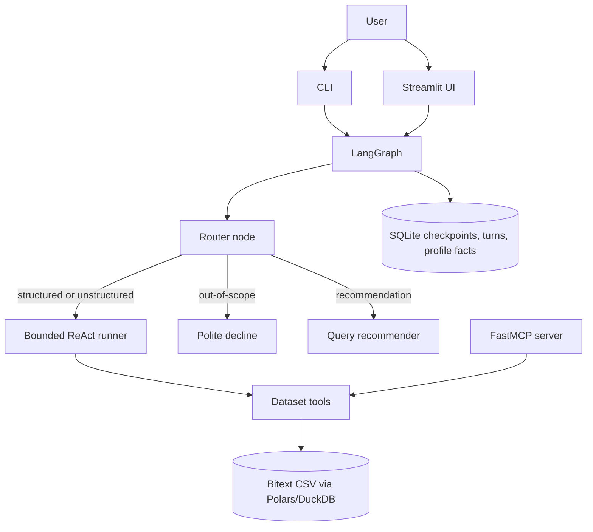

# zakhar-kogan-nebius-bitext

LangGraph data analyst agent for the Bitext Customer Service dataset assignment.

The agent answers structured and unstructured questions about the dataset, declines unrelated questions, persists conversation/profile memory, exposes tools through FastMCP, and includes a Streamlit chat UI with query recommendations.

## Prerequisites

Python 3.11+, `uv`, and a Nebius Token Factory API key.

## Quick Start

1. Install dependencies:

   ```bash
   uv sync --extra dev
   ```

2. Create environment config:

   ```bash
   cp .env.example .env
   ```

3. Edit `.env` and set your Nebius Token Factory key:

   ```env
   NEBIUS_API_KEY=...
   ```

4. Download the dataset:

   ```bash
   uv run python scripts/download_dataset.py
   ```

5. Start the CLI:

   ```bash
   uv run bitext-agent --session demo --user-id demo
   ```

The CLI prints route decisions, tool calls, observations, and final answers. Profile memory is distilled during normal graph execution by default; `/exit` also performs a final distillation pass.

Try:

- `What categories exist in the dataset?`
- `How many refund requests did we get?`
- `How many complaints did we get?`
- `What about refunds?`
- `What is the total count of the last two?`
- `Show me 3 examples from the REFUND category`
- `Show a bar chart of the category breakdown.`
- `Show me 3 more`
- `Summarize how agents respond to complaint intents.`
- `What should I query next?`
- `Show me examples instead.`
- `Yes, go ahead.`
- `Who is the president of France?`

## Models

All LLM calls use the Nebius OpenAI-compatible API.

- Router: `nvidia/Nemotron-3-Nano-Omni`, chosen for low-cost classification.
- Main agent: `MiniMaxAI/MiniMax-M2.5-fast`, chosen for fast tool-aware answer generation.
- Recommender/refiner: `RECOMMENDER_MODEL` defaults to the router model when unset.

The router classifies each request before tool selection. The main model runs the bounded ReAct loop over deterministic dataset tools. Structured follow-ups such as `What about refunds?` or `What is the total count of the last two?` are routed into that loop with recent turns and checkpoint context available.

## CLI

Equivalent module command:

```bash
uv run python -m bitext_agent.cli --session demo --user-id demo
```

## MCP

Start the FastMCP server:

```bash
uv run fastmcp run src/bitext_agent/mcp_server.py:mcp
```

Exposed tools include `list_categories`, `count_rows`, `category_distribution`, `show_examples`, and `intent_distribution`.

Call a tool from a Python client:

```python
import asyncio

from fastmcp import Client


async def main() -> None:
    async with Client("src/bitext_agent/mcp_server.py:mcp") as client:
        result = await client.call_tool("list_categories", {})
        print(result)


asyncio.run(main())
```

## Streamlit

```bash
uv run streamlit run src/bitext_agent/streamlit_app.py
```

The UI provides chat, inline dataset charts, visual quick actions, session selection, reasoning traces, query recommendations, profile memory controls, dataset diagnostics, and usage/tool-call stats.

Recommendation buttons in Streamlit are convenience shortcuts and run immediately when clicked. The assignment-style recommendation branch is available in both CLI and Streamlit chat: type `What should I query next?`, refine the suggestion in conversation if needed, and confirm before the agent executes it.

## One-command local start

Start both the Streamlit UI and an HTTP FastMCP server:

```bash
uv run start
```

This starts Streamlit at `http://127.0.0.1:8501` and MCP at `http://127.0.0.1:8000`.

Useful options:

```bash
uv run start --no-mcp
uv run start --no-streamlit
uv run start --streamlit-port 8600 --mcp-port 9000
uv run start --mcp-transport sse --mcp-path /sse/
```

## LangGraph Studio And LangSmith

The app works without LangSmith. For local graph debugging, set these in `.env`:

```env
LANGSMITH_API_KEY=...
LANGSMITH_TRACING=true
```

`langgraph.json` points Studio at `src/bitext_agent/graph.py:graph`.

## Architecture



- A LangGraph router node classifies each request as structured, unstructured, out-of-scope, or recommendation before any tool selection.
- Out-of-scope requests are declined without using the LLM's general knowledge.
- The ReAct runner uses bounded tool calls, prints route/tool/observation reasoning in the CLI and UI, and returns a graceful fallback at `MAX_AGENT_ITERATIONS`.
- SQLite persists LangGraph checkpoints, conversation turns, and distilled user profile facts. The profile stores facts such as names, topic interests, and answer preferences, not a replay of past messages.
- FastMCP exposes deterministic dataset tools backed by Polars and DuckDB. Tools are defined with clear names, descriptions, Pydantic argument schemas, and typed result schemas. Chart tools return structured rows and chart metadata that Streamlit renders inline.
- The recommendation route is separate from dataset answering: it suggests a query from conversation history and profile memory, stores it as pending, uses a small LLM refinement prompt for requested changes, and executes only after confirmation.

## Tests

```bash
uv run pytest
```

Tests cover config, dataset validation, normalization, tools, user UUID mapping, profile CRUD, prompt overrides, recommendation state, usage logging, routing, and conversation follow-ups.

## Docker

Docker is optional; local `uv` is the primary grading path.

```bash
docker compose up --build
```

Compose starts Streamlit on `http://127.0.0.1:8501` and the HTTP MCP server on `http://127.0.0.1:8000/mcp/`. The image installs from `uv.lock` for reproducible dependency resolution.
